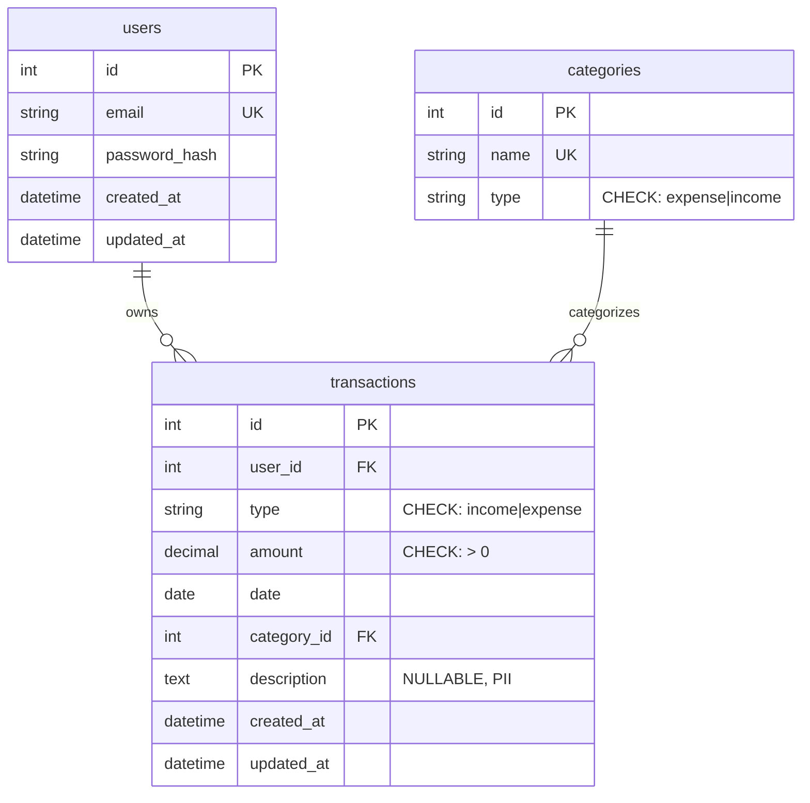

# Data Model — Expense Tracker

This document describes the database schema for the Expense Tracker application.

---

## Entity-Relationship Diagram



---

## Tables

### users

**Purpose**: Store user authentication and profile information.

| Column | Type | Constraints | Description |
|--------|------|-------------|-------------|
| id | INTEGER | PRIMARY KEY, AUTO INCREMENT | Unique user identifier |
| email | VARCHAR(255) | NOT NULL, UNIQUE | User email address |
| password_hash | VARCHAR(255) | NOT NULL | Hashed password |
| created_at | TIMESTAMP | NOT NULL, DEFAULT NOW() | Account creation timestamp |
| updated_at | TIMESTAMP | NOT NULL, DEFAULT NOW() | Last update timestamp |

**Indexes**:
- `idx_users_email` on (email) — Fast email lookups for authentication

---

### categories

**Purpose**: Store predefined expense and income categories for transaction classification.

| Column | Type | Constraints | Description |
|--------|------|-------------|-------------|
| id | INTEGER | PRIMARY KEY, AUTO INCREMENT | Unique category identifier |
| name | VARCHAR(100) | NOT NULL, UNIQUE | Category name (e.g., "Food", "Transportation") |
| type | VARCHAR(20) | NOT NULL, CHECK IN ('expense', 'income') | Category type |

**Check Constraints**:
- `check_category_type`: Ensures type is either 'expense' or 'income'

**Seed Data** (Expense Categories):
1. Food
2. Transportation
3. Entertainment
4. Utilities
5. Health
6. Other

---

### transactions

**Purpose**: Store all income and expense transactions for users.

**⚠️ PII SECURITY**: The `amount` and `description` fields contain sensitive financial data. Database encryption at rest must be enabled at the infrastructure level.

| Column | Type | Constraints | Description |
|--------|------|-------------|-------------|
| id | INTEGER | PRIMARY KEY, AUTO INCREMENT | Unique transaction identifier |
| user_id | INTEGER | NOT NULL, FK → users.id | Owner of the transaction |
| type | VARCHAR(20) | NOT NULL, CHECK IN ('income', 'expense') | Transaction type |
| amount | NUMERIC(10,2) | NOT NULL, CHECK > 0 | Transaction amount (must be positive) |
| date | DATE | NOT NULL | Transaction date |
| category_id | INTEGER | NOT NULL, FK → categories.id | Category classification |
| description | TEXT | NULLABLE | Optional transaction description (PII) |
| created_at | TIMESTAMP | NOT NULL, DEFAULT NOW() | Record creation timestamp |
| updated_at | TIMESTAMP | NOT NULL, DEFAULT NOW() | Last update timestamp |

**Foreign Keys**:
- `fk_transactions_user_id`: user_id → users.id (ensures row-level ownership for BOLA prevention)
- `fk_transactions_category_id`: category_id → categories.id (ensures valid category)

**Check Constraints**:
- `check_amount_positive`: Ensures amount > 0
- `check_transaction_type`: Ensures type is either 'income' or 'expense'

**Indexes**:
- `idx_transactions_user_date` on (user_id, date) — Supports date range queries for reports and analytics (P95 < 100ms for 10K transactions)
- `idx_transactions_user_category` on (user_id, category_id) — Supports category aggregations for charts (P95 < 100ms)

---

## Migrations

Migrations are managed with Alembic. Migration files are located in `backend/alembic/versions/`.

**Applied Migrations**:
1. `20260203_1840_001_create_users_table.py` — Initial users table
2. `20260203_2123_b6db15062087_create_transactions_and_categories_.py` — Transactions and categories tables with indexes and seed data

**To apply migrations**:
```bash
docker compose exec backend alembic upgrade head
```

**To rollback last migration**:
```bash
docker compose exec backend alembic downgrade -1
```

---

## Security Considerations

1. **PII Data**: `transactions.amount` and `transactions.description` contain sensitive financial information
   - Database encryption at rest is required
   - Do NOT log these fields in application logs
   - Implement proper access controls in the application layer

2. **Authorization**: The `user_id` foreign key ensures row-level ownership
   - Application must verify ownership before allowing access (BOLA prevention)
   - Never trust user_id from client requests — always use authenticated user ID from JWT

3. **Data Integrity**: Check constraints prevent invalid data at the database level
   - Amount must be positive
   - Type must be valid enum value
   - Foreign keys ensure referential integrity

---

## Performance Considerations

1. **Indexes**: Composite indexes on (user_id, date) and (user_id, category_id) support common query patterns
   - Date range queries for transaction lists
   - Category aggregations for charts and reports
   - Target: P95 < 100ms for queries on 10K transactions

2. **Query Optimization**: Always filter by user_id first to leverage indexes
   - Good: `WHERE user_id = ? AND date BETWEEN ? AND ?`
   - Bad: `WHERE date BETWEEN ? AND ?` (full table scan)

---

## Future Enhancements

Potential schema changes for future features:
- Soft delete column for transactions (audit trail)
- Recurring transactions table
- Multi-currency support (currency column + exchange rates table)
- Transaction attachments (receipts, invoices)
- Budget tracking tables
- Shared transactions (multi-user ownership)
