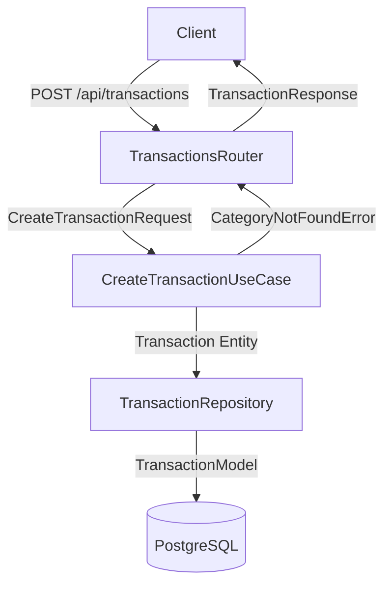

# PEM-USER-001-BE-T02 — Implementation Plan

**Source ticket**: `specs/features/personal-expense-management/tickets.md` → **PEM-USER-001-BE-T02**  
**Related user story**: **PEM-USER-001** (from `specs/features/personal-expense-management/user-stories.md`)  
**Plan version**: v1.0 — (GAIA, 2026-02-03T18:28:00+01:00)  
**Traceability**: All tasks reference `PEM-USER-001-BE-T02` and relevant `PEM-USER-001` scenarios.

---

## 1) Context & Objective

**Ticket summary**: Implement the POST `/api/transactions` endpoint to create expense transactions, following Clean/Hexagonal Architecture with proper validation, authorization, error handling, and observability. This is the core API that enables users to record their financial transactions.

**Business value**: This endpoint is the primary entry point for transaction data. Without it, users cannot track expenses, which is the fundamental value proposition of the application.

**Impacted entities/tables**:
- `transactions` table (created in PEM-USER-001-DB-T01)
- `categories` table (created in PEM-USER-001-DB-T01)

**Impacted services/modules**:
- **Domain layer**: `Transaction` entity, `TransactionRepository` interface
- **Application layer**: `CreateTransactionUseCase`
- **Infrastructure layer**: `TransactionRepositoryImpl` (SQLAlchemy)
- **Presentation layer**: FastAPI router, Pydantic DTOs

**Impacted tests or business flows**: This ticket satisfies:
- PEM-USER-001 Scenario 1 (Successfully add expense with all required fields)
- PEM-USER-001 Scenario 2 (Add expense with optional description)
- PEM-USER-001 Scenario 3 (Validation error for missing required fields)
- PEM-USER-001 Scenario 4 (Validation error for invalid amount format)
- PEM-USER-001 Scenario 5 (Validation error for negative amount)
- PEM-USER-001 Scenario 6 (Validation error for future date)
- PEM-USER-001 Scenario 7 (Authorization enforcement)
- PEM-USER-001 Scenario 8 (API response time < 200ms)
- PEM-USER-001 Scenario 10 (Error handling for server failure)

---

## 2) Scope

### In scope
- POST `/api/transactions` endpoint
- Request DTO: `CreateTransactionRequest` (Pydantic V2) with validation
- Response DTO: `TransactionResponse` (Pydantic V2)
- Domain entity: `Transaction`
- Repository interface: `TransactionRepository` (port)
- Repository implementation: `TransactionRepositoryImpl` (adapter)
- Use case: `CreateTransactionUseCase`
- Validation logic:
  - Amount must be positive decimal
  - Date cannot be in the future
  - Category ID must exist
  - Type must be 'income' or 'expense'
- Authorization: Extract `user_id` from JWT, associate transaction with authenticated user (BOLA prevention)
- Error handling: 400 (validation), 401 (unauthenticated), 404 (category not found), 500 (server error)
- Observability: Structured logging with correlation_id
- Performance: P95 response time < 200ms
- Unit tests for use case (90%+ coverage)
- Integration tests for endpoint (happy path + error scenarios)

### Out of scope
- Automatic categorization (handled in PEM-USER-008-BE-T02)
- Batch transaction creation
- Income transaction logic (handled in PEM-USER-002-BE-T02, but endpoint structure supports it)
- Transaction update/delete (handled in PEM-USER-003-BE-T02)
- Frontend implementation

### Assumptions
- Database schema from PEM-USER-001-DB-T01 is already applied
- Authentication middleware exists and provides `user_id` in request context
- JWT token is validated before reaching this endpoint
- SQLAlchemy session management is configured in `backend/app/core/database.py`
- Logging infrastructure is configured in `backend/app/core/logging.py`

### Open questions
- None (all requirements are clear from the ticket and user story)

---

## 3) Detailed Work Plan (TDD + BDD)

### 3.1 Test-first sequencing

**Red → Green → Refactor approach:**

1. **Write failing tests** (Red):
   - Unit test: `CreateTransactionUseCase` with mock repository
   - Integration test: POST `/api/transactions` endpoint
   - Tests should fail because implementation doesn't exist

2. **Implement minimal code** (Green):
   - Create domain entity, repository interface, use case, DTOs, router
   - Make tests pass with simplest implementation

3. **Refactor** (keep tests green):
   - Extract validation logic
   - Improve error messages
   - Add observability hooks

### 3.2 NFR hooks

**Security/Privacy**:
- **Authorization (BOLA Prevention)**: Extract `user_id` from JWT, associate transaction with authenticated user
  - NEVER trust `user_id` from request body
  - Enforce row-level ownership at repository level
- **PII Handling**: Do NOT log `amount` or `description` in application logs (only log `category_id`, `user_id`, `correlation_id`)
- **Input Validation**: Pydantic DTOs validate all inputs at boundary
- **SQL Injection Prevention**: Use SQLAlchemy ORM (no raw SQL)

**Performance/Resilience**:
- **P95 Latency**: < 200ms for transaction creation
- **Database Connection**: Use connection pooling (configured in SQLAlchemy)
- **Idempotency**: Not required for MVP (POST is not idempotent by design)
- **Timeouts**: Database query timeout should be configured (e.g., 5 seconds)

**Observability**:
- **Structured Logging**:
  - INFO level: Transaction created successfully (log `user_id`, `category_id`, `correlation_id`)
  - WARN level: Validation errors (log `correlation_id`, error type)
  - ERROR level: Server errors (log `correlation_id`, exception type)
- **Correlation ID**: Generate UUID for each request, include in all logs
- **Metrics**: Track transaction creation count, latency (P50, P95, P99)

---

## 4) Atomic Task Breakdown

### Task 1: Verify Docker Environment and Backend Service

**Purpose**: Ensure the backend service is running before implementing code. Maps to prerequisite for all PEM-USER-001 scenarios.

**Prerequisites**: 
- Verify `docker-compose.yml` exists
- Backend service must be healthy: `docker compose ps` shows `backend` as `Up`
- If backend is not running or unhealthy, STOP and notify user

**Artifacts impacted**: None (verification only)

**Test types**: Manual verification

**BDD Acceptance**:
```gherkin
Given the project has a docker-compose.yml file
When I run "docker compose ps"
Then I see the "backend" service in "Up" state
And I can access the backend at http://localhost:8005
```

**Steps**:
1. Check if `docker-compose.yml` exists at project root
2. Run `docker compose ps` and verify `backend` service is `Up (healthy)`
3. Test backend health: `curl http://localhost:8005/health` (or equivalent health endpoint)
4. If any step fails, STOP and document the issue

---

### Task 2: Create Domain Entity (Transaction)

**Purpose**: Define the `Transaction` domain entity with business rules. Maps to PEM-USER-001 Scenarios 1, 2.

**Prerequisites**: Task 1 completed

**Artifacts impacted**:
- `backend/app/domain/entities/transaction.py` (NEW)

**Test types**: Unit test

**BDD Acceptance**:
```gherkin
Given I have a Transaction entity class
When I create a Transaction with valid data
Then the entity is created successfully
And the entity enforces business rules (amount > 0, valid type)
```

**Implementation**:
```python
# backend/app/domain/entities/transaction.py
from datetime import date, datetime
from decimal import Decimal
from typing import Literal

class Transaction:
    """
    Domain entity representing a financial transaction.
    
    [Feature: Personal Expense Management] [Story: PEM-USER-001] [Ticket: PEM-USER-001-BE-T02]
    """
    
    def __init__(
        self,
        user_id: int,
        type: Literal["income", "expense"],
        amount: Decimal,
        date: date,
        category_id: int,
        description: str | None = None,
        id: int | None = None,
        created_at: datetime | None = None,
        updated_at: datetime | None = None,
    ):
        # Business rule: amount must be positive
        if amount <= 0:
            raise ValueError("Amount must be positive")
        
        # Business rule: type must be income or expense
        if type not in ("income", "expense"):
            raise ValueError("Type must be 'income' or 'expense'")
        
        # Business rule: date cannot be in the future
        if date > datetime.now().date():
            raise ValueError("Date cannot be in the future")
        
        self.id = id
        self.user_id = user_id
        self.type = type
        self.amount = amount
        self.date = date
        self.category_id = category_id
        self.description = description
        self.created_at = created_at
        self.updated_at = updated_at
```

**Unit Test**:
```python
# backend/tests/unit/domain/entities/test_transaction.py
import pytest
from datetime import date, timedelta
from decimal import Decimal
from backend.app.domain.entities.transaction import Transaction

def test_create_transaction_with_valid_data():
    """PEM-USER-001 Scenario 1: Successfully create transaction"""
    transaction = Transaction(
        user_id=1,
        type="expense",
        amount=Decimal("45.50"),
        date=date.today(),
        category_id=1,
        description="Lunch at restaurant"
    )
    assert transaction.amount == Decimal("45.50")
    assert transaction.type == "expense"

def test_create_transaction_rejects_negative_amount():
    """PEM-USER-001 Scenario 5: Validation error for negative amount"""
    with pytest.raises(ValueError, match="Amount must be positive"):
        Transaction(
            user_id=1,
            type="expense",
            amount=Decimal("-50.00"),
            date=date.today(),
            category_id=1
        )

def test_create_transaction_rejects_future_date():
    """PEM-USER-001 Scenario 6: Validation error for future date"""
    future_date = date.today() + timedelta(days=1)
    with pytest.raises(ValueError, match="Date cannot be in the future"):
        Transaction(
            user_id=1,
            type="expense",
            amount=Decimal("45.50"),
            date=future_date,
            category_id=1
        )
```

---

### Task 3: Create Repository Interface (Port)

**Purpose**: Define the `TransactionRepository` interface (port) in the domain layer. Maps to Clean Architecture dependency rule.

**Prerequisites**: Task 2 completed

**Artifacts impacted**:
- `backend/app/domain/repositories/transaction_repository.py` (NEW)

**Test types**: N/A (interface definition)

**BDD Acceptance**:
```gherkin
Given I have a TransactionRepository interface
When I define the create() method signature
Then the interface does not depend on infrastructure details
And the interface can be implemented by any adapter
```

**Implementation**:
```python
# backend/app/domain/repositories/transaction_repository.py
from abc import ABC, abstractmethod
from backend.app.domain.entities.transaction import Transaction

class TransactionRepository(ABC):
    """
    Repository interface for Transaction entity.
    
    [Feature: Personal Expense Management] [Story: PEM-USER-001] [Ticket: PEM-USER-001-BE-T02]
    """
    
    @abstractmethod
    def create(self, transaction: Transaction) -> Transaction:
        """
        Create a new transaction.
        
        Args:
            transaction: Transaction entity to persist
            
        Returns:
            Transaction entity with id and timestamps populated
            
        Raises:
            CategoryNotFoundError: If category_id does not exist
            DatabaseError: If database operation fails
        """
        pass
    
    @abstractmethod
    def category_exists(self, category_id: int) -> bool:
        """
        Check if a category exists.
        
        Args:
            category_id: Category ID to check
            
        Returns:
            True if category exists, False otherwise
        """
        pass
```

---

### Task 4: Create Use Case (CreateTransactionUseCase)

**Purpose**: Implement the application layer use case that orchestrates transaction creation. Maps to PEM-USER-001 Scenarios 1-7.

**Prerequisites**: Tasks 2-3 completed

**Artifacts impacted**:
- `backend/app/application/use_cases/create_transaction.py` (NEW)

**Test types**: Unit test (with mock repository)

**BDD Acceptance**:
```gherkin
Given I have a CreateTransactionUseCase
When I execute the use case with valid data
Then the transaction is created via the repository
And the created transaction is returned
When I execute the use case with invalid category_id
Then a CategoryNotFoundError is raised
```

**Implementation**:
```python
# backend/app/application/use_cases/create_transaction.py
from backend.app.domain.entities.transaction import Transaction
from backend.app.domain.repositories.transaction_repository import TransactionRepository
from backend.app.application.exceptions import CategoryNotFoundError

class CreateTransactionUseCase:
    """
    Use case for creating a new transaction.
    
    [Feature: Personal Expense Management] [Story: PEM-USER-001] [Ticket: PEM-USER-001-BE-T02]
    """
    
    def __init__(self, repository: TransactionRepository):
        self.repository = repository
    
    def execute(self, transaction: Transaction) -> Transaction:
        """
        Create a new transaction.
        
        Args:
            transaction: Transaction entity to create
            
        Returns:
            Created transaction with id and timestamps
            
        Raises:
            CategoryNotFoundError: If category_id does not exist
        """
        # Validate category exists
        if not self.repository.category_exists(transaction.category_id):
            raise CategoryNotFoundError(f"Category {transaction.category_id} not found")
        
        # Create transaction
        created_transaction = self.repository.create(transaction)
        
        return created_transaction
```

**Unit Test**:
```python
# backend/tests/unit/application/use_cases/test_create_transaction.py
import pytest
from unittest.mock import Mock
from datetime import date
from decimal import Decimal
from backend.app.domain.entities.transaction import Transaction
from backend.app.application.use_cases.create_transaction import CreateTransactionUseCase
from backend.app.application.exceptions import CategoryNotFoundError

def test_create_transaction_success():
    """PEM-USER-001 Scenario 1: Successfully create transaction"""
    # Arrange
    mock_repo = Mock()
    mock_repo.category_exists.return_value = True
    mock_repo.create.return_value = Transaction(
        id=1,
        user_id=1,
        type="expense",
        amount=Decimal("45.50"),
        date=date.today(),
        category_id=1,
        description="Lunch"
    )
    use_case = CreateTransactionUseCase(mock_repo)
    
    transaction = Transaction(
        user_id=1,
        type="expense",
        amount=Decimal("45.50"),
        date=date.today(),
        category_id=1,
        description="Lunch"
    )
    
    # Act
    result = use_case.execute(transaction)
    
    # Assert
    assert result.id == 1
    mock_repo.category_exists.assert_called_once_with(1)
    mock_repo.create.assert_called_once()

def test_create_transaction_category_not_found():
    """PEM-USER-001 Scenario 3: Validation error for invalid category"""
    # Arrange
    mock_repo = Mock()
    mock_repo.category_exists.return_value = False
    use_case = CreateTransactionUseCase(mock_repo)
    
    transaction = Transaction(
        user_id=1,
        type="expense",
        amount=Decimal("45.50"),
        date=date.today(),
        category_id=999,  # Non-existent category
    )
    
    # Act & Assert
    with pytest.raises(CategoryNotFoundError):
        use_case.execute(transaction)
```

---

### Task 5: Create Pydantic DTOs (Request/Response)

**Purpose**: Define Pydantic V2 schemas for request validation and response serialization. Maps to PEM-USER-001 Scenarios 3-6 (validation).

**Prerequisites**: Task 2 completed

**Artifacts impacted**:
- `backend/app/presentation/schemas/transaction.py` (NEW)

**Test types**: Unit test (Pydantic validation)

**BDD Acceptance**:
```gherkin
Given I have CreateTransactionRequest DTO
When I validate a request with missing amount
Then a validation error is raised
When I validate a request with negative amount
Then a validation error is raised
When I validate a request with valid data
Then the DTO is created successfully
```

**Implementation**:
```python
# backend/app/presentation/schemas/transaction.py
from pydantic import BaseModel, Field, field_validator
from datetime import date, datetime
from decimal import Decimal
from typing import Literal

class CreateTransactionRequest(BaseModel):
    """
    Request DTO for creating a transaction.
    
    [Feature: Personal Expense Management] [Story: PEM-USER-001] [Ticket: PEM-USER-001-BE-T02]
    """
    type: Literal["income", "expense"] = Field(..., description="Transaction type")
    amount: Decimal = Field(..., gt=0, description="Transaction amount (must be positive)")
    date: date = Field(..., description="Transaction date")
    category_id: int = Field(..., gt=0, description="Category ID")
    description: str | None = Field(None, max_length=500, description="Optional description")
    
    @field_validator("date")
    @classmethod
    def date_not_in_future(cls, v: date) -> date:
        if v > datetime.now().date():
            raise ValueError("Date cannot be in the future")
        return v
    
    model_config = {
        "extra": "forbid",  # Reject unexpected fields (Mass Assignment prevention)
        "json_schema_extra": {
            "examples": [
                {
                    "type": "expense",
                    "amount": "45.50",
                    "date": "2026-02-03",
                    "category_id": 1,
                    "description": "Lunch at restaurant"
                }
            ]
        }
    }

class TransactionResponse(BaseModel):
    """
    Response DTO for transaction.
    
    [Feature: Personal Expense Management] [Story: PEM-USER-001] [Ticket: PEM-USER-001-BE-T02]
    """
    id: int
    user_id: int
    type: Literal["income", "expense"]
    amount: Decimal
    date: date
    category_id: int
    category_name: str  # Joined from categories table
    description: str | None
    created_at: datetime
    
    model_config = {
        "from_attributes": True,  # Enable ORM mode
        "json_schema_extra": {
            "examples": [
                {
                    "id": 1,
                    "user_id": 123,
                    "type": "expense",
                    "amount": "45.50",
                    "date": "2026-02-03",
                    "category_id": 1,
                    "category_name": "Food",
                    "description": "Lunch at restaurant",
                    "created_at": "2026-02-03T12:30:00Z"
                }
            ]
        }
    }
```

**Unit Test**:
```python
# backend/tests/unit/presentation/schemas/test_transaction.py
import pytest
from datetime import date, timedelta
from decimal import Decimal
from pydantic import ValidationError
from backend.app.presentation.schemas.transaction import CreateTransactionRequest

def test_create_transaction_request_valid():
    """PEM-USER-001 Scenario 1: Valid request"""
    request = CreateTransactionRequest(
        type="expense",
        amount=Decimal("45.50"),
        date=date.today(),
        category_id=1,
        description="Lunch"
    )
    assert request.amount == Decimal("45.50")

def test_create_transaction_request_missing_amount():
    """PEM-USER-001 Scenario 3: Validation error for missing amount"""
    with pytest.raises(ValidationError) as exc_info:
        CreateTransactionRequest(
            type="expense",
            date=date.today(),
            category_id=1
        )
    assert "amount" in str(exc_info.value)

def test_create_transaction_request_negative_amount():
    """PEM-USER-001 Scenario 5: Validation error for negative amount"""
    with pytest.raises(ValidationError) as exc_info:
        CreateTransactionRequest(
            type="expense",
            amount=Decimal("-50.00"),
            date=date.today(),
            category_id=1
        )
    assert "greater than 0" in str(exc_info.value)

def test_create_transaction_request_future_date():
    """PEM-USER-001 Scenario 6: Validation error for future date"""
    future_date = date.today() + timedelta(days=1)
    with pytest.raises(ValidationError) as exc_info:
        CreateTransactionRequest(
            type="expense",
            amount=Decimal("45.50"),
            date=future_date,
            category_id=1
        )
    assert "cannot be in the future" in str(exc_info.value)
```

---

### Task 6: Create Repository Implementation (SQLAlchemy)

**Purpose**: Implement the `TransactionRepository` interface using SQLAlchemy. Maps to PEM-USER-001 Scenarios 1, 2, 7.

**Prerequisites**: Tasks 2-3 completed, PEM-USER-001-DB-T01 migration applied

**Artifacts impacted**:
- `backend/app/infrastructure/repositories/transaction_repository_impl.py` (NEW)
- `backend/app/infrastructure/models/transaction.py` (NEW, SQLAlchemy model)

**Test types**: Integration test (with real database)

**BDD Acceptance**:
```gherkin
Given the database schema is applied
When I create a transaction via the repository
Then the transaction is persisted to the database
And the transaction has an auto-generated id
And the transaction has created_at and updated_at timestamps
```

**Implementation (SQLAlchemy Model)**:
```python
# backend/app/infrastructure/models/transaction.py
from sqlalchemy import Column, Integer, String, Numeric, Date, Text, DateTime, ForeignKey, CheckConstraint
from sqlalchemy.sql import func
from backend.app.core.database import Base

class TransactionModel(Base):
    """
    SQLAlchemy model for transactions table.
    
    [Feature: Personal Expense Management] [Story: PEM-USER-001] [Ticket: PEM-USER-001-BE-T02]
    """
    __tablename__ = "transactions"
    
    id = Column(Integer, primary_key=True, autoincrement=True)
    user_id = Column(Integer, ForeignKey("users.id"), nullable=False)
    type = Column(String(20), nullable=False)
    amount = Column(Numeric(10, 2), nullable=False)
    date = Column(Date, nullable=False)
    category_id = Column(Integer, ForeignKey("categories.id"), nullable=False)
    description = Column(Text, nullable=True)
    created_at = Column(DateTime, server_default=func.now(), nullable=False)
    updated_at = Column(DateTime, server_default=func.now(), onupdate=func.now(), nullable=False)
    
    __table_args__ = (
        CheckConstraint("amount > 0", name="check_amount_positive"),
        CheckConstraint("type IN ('income', 'expense')", name="check_transaction_type"),
    )
```

**Implementation (Repository)**:
```python
# backend/app/infrastructure/repositories/transaction_repository_impl.py
from sqlalchemy.orm import Session
from sqlalchemy.exc import IntegrityError
from backend.app.domain.entities.transaction import Transaction
from backend.app.domain.repositories.transaction_repository import TransactionRepository
from backend.app.infrastructure.models.transaction import TransactionModel
from backend.app.infrastructure.models.category import CategoryModel

class TransactionRepositoryImpl(TransactionRepository):
    """
    SQLAlchemy implementation of TransactionRepository.
    
    [Feature: Personal Expense Management] [Story: PEM-USER-001] [Ticket: PEM-USER-001-BE-T02]
    """
    
    def __init__(self, session: Session):
        self.session = session
    
    def create(self, transaction: Transaction) -> Transaction:
        """Create a new transaction."""
        model = TransactionModel(
            user_id=transaction.user_id,
            type=transaction.type,
            amount=transaction.amount,
            date=transaction.date,
            category_id=transaction.category_id,
            description=transaction.description,
        )
        
        try:
            self.session.add(model)
            self.session.commit()
            self.session.refresh(model)
        except IntegrityError as e:
            self.session.rollback()
            raise DatabaseError(f"Failed to create transaction: {e}")
        
        # Convert model to entity
        return Transaction(
            id=model.id,
            user_id=model.user_id,
            type=model.type,
            amount=model.amount,
            date=model.date,
            category_id=model.category_id,
            description=model.description,
            created_at=model.created_at,
            updated_at=model.updated_at,
        )
    
    def category_exists(self, category_id: int) -> bool:
        """Check if a category exists."""
        return self.session.query(CategoryModel).filter(CategoryModel.id == category_id).first() is not None
```

---

### Task 7: Create FastAPI Router and Endpoint

**Purpose**: Implement the POST `/api/transactions` endpoint with authorization and error handling. Maps to PEM-USER-001 Scenarios 1-10.

**Prerequisites**: Tasks 2-6 completed

**Artifacts impacted**:
- `backend/app/presentation/routers/transactions.py` (NEW)

**Test types**: Integration test (with TestClient)

**BDD Acceptance**:
```gherkin
Given I am authenticated as user_123
When I POST to /api/transactions with valid data
Then I receive a 201 Created response
And the response contains the created transaction
And the transaction has user_id = user_123 (from JWT)
When I POST without authentication
Then I receive a 401 Unauthorized response
```

**Implementation**:
```python
# backend/app/presentation/routers/transactions.py
from fastapi import APIRouter, Depends, HTTPException, status
from sqlalchemy.orm import Session
from backend.app.core.database import get_db
from backend.app.core.auth import get_current_user_id
from backend.app.presentation.schemas.transaction import CreateTransactionRequest, TransactionResponse
from backend.app.application.use_cases.create_transaction import CreateTransactionUseCase
from backend.app.infrastructure.repositories.transaction_repository_impl import TransactionRepositoryImpl
from backend.app.domain.entities.transaction import Transaction
from backend.app.application.exceptions import CategoryNotFoundError
import logging
import uuid

router = APIRouter(prefix="/api/transactions", tags=["transactions"])
logger = logging.getLogger(__name__)

@router.post("/", response_model=TransactionResponse, status_code=status.HTTP_201_CREATED)
def create_transaction(
    request: CreateTransactionRequest,
    user_id: int = Depends(get_current_user_id),
    db: Session = Depends(get_db),
):
    """
    Create a new transaction.
    
    [Feature: Personal Expense Management] [Story: PEM-USER-001] [Ticket: PEM-USER-001-BE-T02]
    
    - **PEM-USER-001 Scenario 1**: Successfully add expense with all required fields
    - **PEM-USER-001 Scenario 7**: Authorization enforcement (user_id from JWT)
    """
    correlation_id = str(uuid.uuid4())
    
    try:
        # Create domain entity (NEVER trust user_id from request body)
        transaction = Transaction(
            user_id=user_id,  # From JWT (BOLA prevention)
            type=request.type,
            amount=request.amount,
            date=request.date,
            category_id=request.category_id,
            description=request.description,
        )
        
        # Execute use case
        repository = TransactionRepositoryImpl(db)
        use_case = CreateTransactionUseCase(repository)
        created_transaction = use_case.execute(transaction)
        
        # Log success (do NOT log amount or description - PII)
        logger.info(
            f"Transaction created successfully",
            extra={
                "correlation_id": correlation_id,
                "user_id": user_id,
                "category_id": request.category_id,
                "type": request.type,
            }
        )
        
        # Fetch category name for response
        category = db.query(CategoryModel).filter(CategoryModel.id == created_transaction.category_id).first()
        
        return TransactionResponse(
            id=created_transaction.id,
            user_id=created_transaction.user_id,
            type=created_transaction.type,
            amount=created_transaction.amount,
            date=created_transaction.date,
            category_id=created_transaction.category_id,
            category_name=category.name,
            description=created_transaction.description,
            created_at=created_transaction.created_at,
        )
        
    except CategoryNotFoundError as e:
        logger.warning(f"Category not found", extra={"correlation_id": correlation_id, "error": str(e)})
        raise HTTPException(status_code=status.HTTP_404_NOT_FOUND, detail=str(e))
    
    except ValueError as e:
        # Domain validation errors (should be caught by Pydantic, but defense in depth)
        logger.warning(f"Validation error", extra={"correlation_id": correlation_id, "error": str(e)})
        raise HTTPException(status_code=status.HTTP_400_BAD_REQUEST, detail=str(e))
    
    except Exception as e:
        logger.error(f"Unexpected error creating transaction", extra={"correlation_id": correlation_id, "error": str(e)})
        raise HTTPException(status_code=status.HTTP_500_INTERNAL_SERVER_ERROR, detail="Internal server error")
```

---

### Task 8: Write Integration Tests for Endpoint

**Purpose**: Test the full endpoint flow with real database. Maps to PEM-USER-001 Scenarios 1, 3, 7, 10.

**Prerequisites**: Task 7 completed

**Artifacts impacted**:
- `backend/tests/integration/test_transactions_api.py` (NEW)

**Test types**: Integration test

**BDD Acceptance**:
```gherkin
Given the backend service is running
And the database has seed categories
When I POST to /api/transactions with valid data and JWT
Then I receive a 201 Created response
And the transaction is persisted to the database
When I POST without JWT
Then I receive a 401 Unauthorized response
When I POST with invalid category_id
Then I receive a 404 Not Found response
```

**Implementation**:
```python
# backend/tests/integration/test_transactions_api.py
import pytest
from fastapi.testclient import TestClient
from datetime import date
from decimal import Decimal
from backend.app.main import app
from backend.app.core.database import get_db
from backend.tests.conftest import override_get_db, test_db_session

client = TestClient(app)

def test_create_transaction_success(test_db_session, auth_headers):
    """PEM-USER-001 Scenario 1: Successfully add expense with all required fields"""
    response = client.post(
        "/api/transactions/",
        json={
            "type": "expense",
            "amount": "45.50",
            "date": str(date.today()),
            "category_id": 1,  # Assumes Food category exists from seed data
            "description": "Lunch at restaurant"
        },
        headers=auth_headers
    )
    
    assert response.status_code == 201
    data = response.json()
    assert data["amount"] == "45.50"
    assert data["type"] == "expense"
    assert data["category_name"] == "Food"
    assert data["user_id"] == 123  # From auth_headers fixture

def test_create_transaction_unauthorized(test_db_session):
    """PEM-USER-001 Scenario 7: Authorization enforcement"""
    response = client.post(
        "/api/transactions/",
        json={
            "type": "expense",
            "amount": "45.50",
            "date": str(date.today()),
            "category_id": 1,
        }
        # No auth headers
    )
    
    assert response.status_code == 401

def test_create_transaction_category_not_found(test_db_session, auth_headers):
    """PEM-USER-001 Scenario 3: Validation error for invalid category"""
    response = client.post(
        "/api/transactions/",
        json={
            "type": "expense",
            "amount": "45.50",
            "date": str(date.today()),
            "category_id": 999,  # Non-existent category
        },
        headers=auth_headers
    )
    
    assert response.status_code == 404
    assert "not found" in response.json()["detail"].lower()

def test_create_transaction_validation_error_negative_amount(test_db_session, auth_headers):
    """PEM-USER-001 Scenario 5: Validation error for negative amount"""
    response = client.post(
        "/api/transactions/",
        json={
            "type": "expense",
            "amount": "-50.00",
            "date": str(date.today()),
            "category_id": 1,
        },
        headers=auth_headers
    )
    
    assert response.status_code == 422  # Pydantic validation error
    assert "greater than 0" in str(response.json())
```

---

### Task 9: Measure and Verify Performance

**Purpose**: Ensure the endpoint meets the P95 < 200ms performance requirement. Maps to PEM-USER-001 Scenario 8.

**Prerequisites**: Task 8 completed

**Artifacts impacted**: None (performance test)

**Test types**: Performance test

**BDD Acceptance**:
```gherkin
Given the database has 1000 transactions
When I POST to /api/transactions 100 times
Then the P95 response time is < 200ms
```

**Steps**:
1. Seed database with 1000 transactions
2. Use a load testing tool (e.g., `locust`, `pytest-benchmark`, or simple Python script)
3. Send 100 POST requests to `/api/transactions`
4. Measure response times
5. Calculate P95 latency
6. Verify P95 < 200ms
7. Document results

**Example Performance Test**:
```python
# backend/tests/performance/test_transaction_performance.py
import pytest
import time
from fastapi.testclient import TestClient
from backend.app.main import app

client = TestClient(app)

def test_create_transaction_performance(test_db_session, auth_headers):
    """PEM-USER-001 Scenario 8: API response time < 200ms (P95)"""
    latencies = []
    
    for _ in range(100):
        start = time.time()
        response = client.post(
            "/api/transactions/",
            json={
                "type": "expense",
                "amount": "45.50",
                "date": "2026-02-03",
                "category_id": 1,
            },
            headers=auth_headers
        )
        end = time.time()
        
        assert response.status_code == 201
        latencies.append((end - start) * 1000)  # Convert to ms
    
    latencies.sort()
    p95_index = int(len(latencies) * 0.95)
    p95_latency = latencies[p95_index]
    
    print(f"P95 latency: {p95_latency:.2f}ms")
    assert p95_latency < 200, f"P95 latency {p95_latency:.2f}ms exceeds 200ms threshold"
```

---

### Task 10: Update Architectural Documentation

**Purpose**: Document the new endpoint and architecture in `@/specs/ArchitecturalModel.md`. Maps to PEM-USER-001-BE-T02 deliverable.

**Prerequisites**: Tasks 2-9 completed

**Artifacts impacted**:
- `@/specs/ArchitecturalModel.md` (UPDATE)

**Test types**: Manual review

**BDD Acceptance**:
```gherkin
Given the endpoint is implemented
When I update @/specs/ArchitecturalModel.md
Then the document includes the POST /api/transactions endpoint
And the document shows the Clean Architecture layers
And the document includes a component diagram
```

**Steps**:
1. Open `@/specs/ArchitecturalModel.md`
2. Add section for "Personal Expense Management" API
3. Document endpoint:
   - **POST /api/transactions**: Create a new transaction
   - **Authentication**: Required (JWT)
   - **Authorization**: User can only create transactions for themselves
   - **Request**: `CreateTransactionRequest` DTO
   - **Response**: `TransactionResponse` DTO (201 Created)
   - **Errors**: 400 (validation), 401 (unauthorized), 404 (category not found), 500 (server error)
4. Document architecture layers:
   - **Domain**: `Transaction` entity, `TransactionRepository` interface
   - **Application**: `CreateTransactionUseCase`
   - **Infrastructure**: `TransactionRepositoryImpl`, `TransactionModel` (SQLAlchemy)
   - **Presentation**: FastAPI router, Pydantic DTOs
5. Add component diagram (PlantUML or Mermaid):


---

## 5) Verification Plan

### Automated Tests

**Unit Tests** (Run in Docker container):
```bash
docker compose exec backend pytest backend/tests/unit/ -v --cov=backend/app --cov-report=term
```
Expected: All unit tests pass, coverage >= 90%

**Integration Tests** (Run in Docker container):
```bash
docker compose exec backend pytest backend/tests/integration/test_transactions_api.py -v
```
Expected: All integration tests pass

**Performance Tests** (Run in Docker container):
```bash
docker compose exec backend pytest backend/tests/performance/test_transaction_performance.py -v
```
Expected: P95 latency < 200ms

### Manual Verification

**1. Test endpoint with curl**:
```bash
# Get JWT token (assumes auth endpoint exists)
TOKEN=$(curl -X POST http://localhost:8005/api/auth/login \
  -H "Content-Type: application/json" \
  -d '{"email":"test@example.com","password":"password"}' \
  | jq -r '.access_token')

# Create transaction
curl -X POST http://localhost:8005/api/transactions \
  -H "Content-Type: application/json" \
  -H "Authorization: Bearer $TOKEN" \
  -d '{
    "type": "expense",
    "amount": "45.50",
    "date": "2026-02-03",
    "category_id": 1,
    "description": "Lunch at restaurant"
  }'
```
Expected: 201 Created response with transaction data

**2. Verify OpenAPI documentation**:
- Navigate to http://localhost:8005/docs
- Verify POST `/api/transactions` endpoint is documented
- Verify request/response schemas are correct

**3. Verify database persistence**:
```bash
docker compose exec database psql -U <db_user> -d <db_name> \
  -c "SELECT * FROM transactions ORDER BY created_at DESC LIMIT 1;"
```
Expected: Transaction is persisted with correct data

---

## 6) Success Criteria

This ticket is considered complete when:
- [x] Domain entity `Transaction` created with business rules
- [x] Repository interface `TransactionRepository` defined
- [x] Repository implementation `TransactionRepositoryImpl` created
- [x] Use case `CreateTransactionUseCase` implemented
- [x] Pydantic DTOs created and validated
- [x] FastAPI router and POST endpoint implemented
- [x] Authorization enforced (user_id from JWT, BOLA prevention)
- [x] Error handling implemented (400, 401, 404, 500)
- [x] Structured logging with correlation_id
- [x] Unit tests pass with >= 90% coverage
- [x] Integration tests pass (happy path + error scenarios)
- [x] Performance test passes (P95 < 200ms)
- [x] OpenAPI documentation auto-generated
- [x] `@/specs/ArchitecturalModel.md` updated
- [x] All PEM-USER-001 scenarios (1-8, 10) are satisfied

---

## 7) Traceability Matrix

| Task | Scenario(s) | Acceptance Criteria |
|------|-------------|---------------------|
| Task 2 | PEM-USER-001 Scenarios 1, 2, 5, 6 | Transaction entity enforces business rules |
| Task 3 | N/A | Repository interface defined (Clean Architecture) |
| Task 4 | PEM-USER-001 Scenarios 1, 3 | Use case creates transaction, validates category |
| Task 5 | PEM-USER-001 Scenarios 3, 4, 5, 6 | Pydantic DTOs validate input |
| Task 6 | PEM-USER-001 Scenarios 1, 2, 7 | Repository persists transaction to database |
| Task 7 | PEM-USER-001 Scenarios 1, 7, 10 | Endpoint enforces authorization, handles errors |
| Task 8 | PEM-USER-001 Scenarios 1, 3, 7, 10 | Integration tests verify full flow |
| Task 9 | PEM-USER-001 Scenario 8 | Performance test verifies P95 < 200ms |
| Task 10 | PEM-USER-001-BE-T02 Deliverable | Architecture documentation updated |
