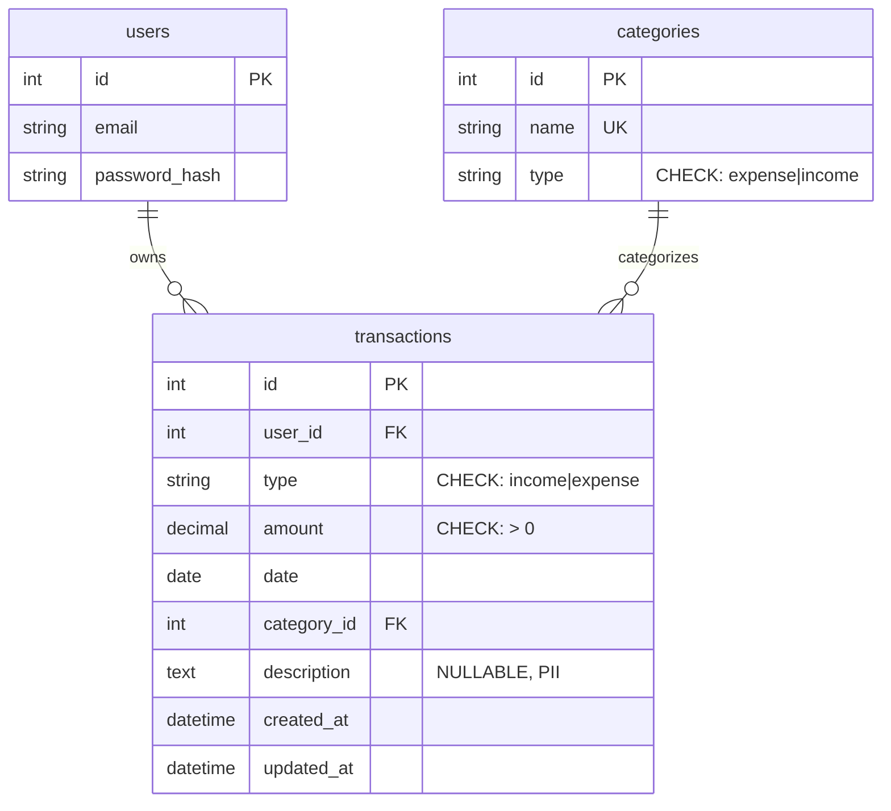

# PEM-USER-001-DB-T01 — Implementation Plan

**Source ticket**: `specs/features/personal-expense-management/tickets.md` → **PEM-USER-001-DB-T01**  
**Related user story**: **PEM-USER-001** (from `specs/features/personal-expense-management/user-stories.md`)  
**Plan version**: v1.0 — (GAIA, 2026-02-03T18:27:00+01:00)  
**Traceability**: All tasks reference `PEM-USER-001-DB-T01` and relevant `PEM-USER-001` scenarios.

---

## 1) Context & Objective

**Ticket summary**: Create the foundational database schema for the Personal Expense Management feature, including `transactions` and `categories` tables with proper constraints, indexes, and seed data. This is the data layer foundation that enables all transaction tracking, categorization, and analytics features.

**Business value**: Without this schema, users cannot record any financial transactions. This is the absolute prerequisite for the entire feature.

**Impacted entities/tables**:
- `transactions` (NEW) — stores all income and expense transactions
- `categories` (NEW) — stores predefined expense and income categories

**Impacted services/modules**:
- Database layer only (no application code in this ticket)
- Alembic migrations
- Data model documentation

**Impacted tests or business flows**: This ticket satisfies the data persistence requirements for:
- PEM-USER-001 Scenario 1 (Successfully add expense with all required fields)
- PEM-USER-001 Scenario 2 (Add expense with optional description)
- PEM-USER-001 Scenario 7 (Authorization enforcement — user_id foreign key)

---

## 2) Scope

### In scope
- Create `transactions` table with all required columns and constraints
- Create `categories` table with all required columns
- Define foreign key relationships: `transactions.user_id` → `users.id`, `transactions.category_id` → `categories.id`
- Add performance indexes: `(user_id, date)`, `(user_id, category_id)`
- Add check constraints: `amount > 0`, `type IN ('income', 'expense')`
- Seed predefined expense categories: Food, Transportation, Entertainment, Utilities, Health, Other
- Document PII sensitivity: `amount` and `description` fields
- Create reversible Alembic migration with tested rollback
- Update `@/specs/DataModel.md` with new tables and ER diagram

### Out of scope
- Income categories (handled in PEM-USER-002-DB-T01)
- Soft delete column (handled in PEM-USER-003-DB-T01 if needed)
- Recurring transactions
- Multi-currency support
- Transaction attachments
- Application layer code (repositories, use cases)

### Assumptions
- A `users` table already exists from the authentication module with a primary key `id`
- PostgreSQL database is configured and accessible via Docker Compose
- Alembic is already initialized in the project
- Database encryption at rest is handled at the infrastructure level (not in migration)

### Open questions
- None (all requirements are clear from the ticket)

---

## 3) Detailed Work Plan (TDD + BDD)

### 3.1 Test-first sequencing

**Red → Green → Refactor approach for database migrations:**

1. **Define migration test** (Red):
   - Write a test that verifies the migration creates the expected schema
   - Test should fail initially because tables don't exist

2. **Implement migration** (Green):
   - Create Alembic migration file
   - Add table creation DDL
   - Add seed data
   - Run migration to make test pass

3. **Refactor** (if needed):
   - Optimize indexes based on query patterns
   - Ensure migration is idempotent and reversible

### 3.2 NFR hooks

**Security/Privacy**:
- **PII Sensitivity**: `transactions.amount` and `transactions.description` contain sensitive financial data
  - Document in migration comments that these fields require encryption at rest (handled by infrastructure)
  - Do NOT log transaction amounts or descriptions in application logs
- **Authorization**: `user_id` foreign key ensures row-level ownership for BOLA prevention
- **Least Privilege**: Migration should run with minimum required database permissions

**Performance/Resilience**:
- **Indexes**: 
  - `(user_id, date)` — supports date range queries for reports and analytics (P95 < 100ms for 10K transactions)
  - `(user_id, category_id)` — supports category aggregations for charts (P95 < 100ms)
  - `(user_id, type, date)` — supports filtering income vs. expense (added in PEM-USER-004-DB-T01)
- **Check Constraints**: Prevent invalid data at database level (`amount > 0`, valid `type` enum)

**Observability**:
- Migration execution should be logged with timestamp and duration
- Rollback capability must be verified and documented

---

## 4) Atomic Task Breakdown

### Task 1: Verify Docker Environment and Database Connectivity

**Purpose**: Ensure the PostgreSQL database is running and accessible before creating migrations. Maps to prerequisite for all PEM-USER-001 scenarios.

**Prerequisites**: 
- Verify `docker-compose.yml` exists in project root
- Containers must be healthy: `docker compose ps` shows `backend`, `frontend`, `database` as `Up`
- If containers are not running or unhealthy, STOP and notify user

**Artifacts impacted**: None (verification only)

**Test types**: Manual verification

**BDD Acceptance**:
```gherkin
Given the project has a docker-compose.yml file
When I run "docker compose ps"
Then I see the "database" service in "Up" state
And I can connect to PostgreSQL on localhost:5455
```

**Steps**:
1. Check if `docker-compose.yml` exists at project root
2. Run `docker compose ps` and verify `database` service is `Up (healthy)`
3. Test database connection: `docker compose exec database psql -U <db_user> -d <db_name> -c "SELECT 1;"`
4. If any step fails, STOP and document the issue

---

### Task 2: Create Alembic Migration File for Transactions and Categories Tables

**Purpose**: Generate the Alembic migration file structure. Maps to PEM-USER-001-DB-T01 deliverable.

**Prerequisites**: Task 1 completed successfully

**Artifacts impacted**:
- `backend/alembic/versions/<timestamp>_create_transactions_and_categories.py` (NEW)

**Test types**: N/A (file generation)

**BDD Acceptance**:
```gherkin
Given Alembic is initialized in the backend directory
When I run "alembic revision -m 'create transactions and categories tables'"
Then a new migration file is created in backend/alembic/versions/
And the file contains empty upgrade() and downgrade() functions
```

**Steps**:
1. Navigate to `backend/` directory
2. Run: `docker compose exec backend alembic revision -m "create transactions and categories tables"`
3. Verify new migration file is created with timestamp prefix
4. Open the file and verify it has `upgrade()` and `downgrade()` function stubs

---

### Task 3: Implement Categories Table Creation in Migration

**Purpose**: Create the `categories` table to store predefined expense categories. Maps to PEM-USER-001 Scenario 1 (select category "Food").

**Prerequisites**: Task 2 completed

**Artifacts impacted**:
- Migration file: `upgrade()` function
- Tables: `categories` (NEW)

**Test types**: Integration (migration execution test)

**BDD Acceptance**:
```gherkin
Given the migration file exists
When I implement the categories table creation DDL
And I run "alembic upgrade head"
Then the categories table exists with columns: id, name, type
And the table has a primary key on id
And the type column has a check constraint for 'expense' or 'income'
```

**Implementation**:
```python
def upgrade() -> None:
    # Create categories table
    op.create_table(
        'categories',
        sa.Column('id', sa.Integer(), primary_key=True, autoincrement=True),
        sa.Column('name', sa.String(100), nullable=False, unique=True),
        sa.Column('type', sa.String(20), nullable=False),
        sa.CheckConstraint("type IN ('expense', 'income')", name='check_category_type')
    )
```

---

### Task 4: Implement Transactions Table Creation in Migration

**Purpose**: Create the `transactions` table to store all income and expense transactions. Maps to PEM-USER-001 Scenarios 1, 2, 7.

**Prerequisites**: Task 3 completed

**Artifacts impacted**:
- Migration file: `upgrade()` function
- Tables: `transactions` (NEW)

**Test types**: Integration (migration execution test)

**BDD Acceptance**:
```gherkin
Given the categories table exists
When I implement the transactions table creation DDL
And I run "alembic upgrade head"
Then the transactions table exists with columns: id, user_id, type, amount, date, category_id, description, created_at, updated_at
And the table has a primary key on id
And user_id has a foreign key to users.id
And category_id has a foreign key to categories.id
And amount has a check constraint > 0
And type has a check constraint IN ('income', 'expense')
```

**Implementation**:
```python
def upgrade() -> None:
    # ... (categories table creation from Task 3)
    
    # Create transactions table
    op.create_table(
        'transactions',
        sa.Column('id', sa.Integer(), primary_key=True, autoincrement=True),
        sa.Column('user_id', sa.Integer(), nullable=False),
        sa.Column('type', sa.String(20), nullable=False),
        sa.Column('amount', sa.Numeric(10, 2), nullable=False),
        sa.Column('date', sa.Date(), nullable=False),
        sa.Column('category_id', sa.Integer(), nullable=False),
        sa.Column('description', sa.Text(), nullable=True),
        sa.Column('created_at', sa.DateTime(), server_default=sa.func.now(), nullable=False),
        sa.Column('updated_at', sa.DateTime(), server_default=sa.func.now(), onupdate=sa.func.now(), nullable=False),
        sa.ForeignKeyConstraint(['user_id'], ['users.id'], name='fk_transactions_user_id'),
        sa.ForeignKeyConstraint(['category_id'], ['categories.id'], name='fk_transactions_category_id'),
        sa.CheckConstraint('amount > 0', name='check_amount_positive'),
        sa.CheckConstraint("type IN ('income', 'expense')", name='check_transaction_type')
    )
```

**PII Security Note**: Add comment in migration:
```python
# PII SECURITY: amount and description fields contain sensitive financial data
# Ensure database encryption at rest is enabled at infrastructure level
```

---

### Task 5: Add Performance Indexes

**Purpose**: Add indexes to support efficient queries for transaction lists, date ranges, and category aggregations. Maps to PEM-USER-001 Scenario 8 (API response time < 200ms).

**Prerequisites**: Task 4 completed

**Artifacts impacted**:
- Migration file: `upgrade()` function
- Indexes: `idx_transactions_user_date`, `idx_transactions_user_category` (NEW)

**Test types**: Integration (migration execution test)

**BDD Acceptance**:
```gherkin
Given the transactions table exists
When I add indexes on (user_id, date) and (user_id, category_id)
And I run "alembic upgrade head"
Then the indexes exist in the database
And queries filtering by user_id and date use the index
And queries filtering by user_id and category_id use the index
```

**Implementation**:
```python
def upgrade() -> None:
    # ... (table creation from Tasks 3-4)
    
    # Add performance indexes
    op.create_index(
        'idx_transactions_user_date',
        'transactions',
        ['user_id', 'date']
    )
    op.create_index(
        'idx_transactions_user_category',
        'transactions',
        ['user_id', 'category_id']
    )
```

---

### Task 6: Add Seed Data for Predefined Expense Categories

**Purpose**: Populate the `categories` table with predefined expense categories. Maps to PEM-USER-001 Scenario 1 (select category "Food").

**Prerequisites**: Task 3 completed

**Artifacts impacted**:
- Migration file: `upgrade()` function
- Data: 6 rows in `categories` table

**Test types**: Integration (data verification test)

**BDD Acceptance**:
```gherkin
Given the categories table exists
When I insert seed data for expense categories
And I run "alembic upgrade head"
Then the categories table contains 6 rows
And the categories are: Food, Transportation, Entertainment, Utilities, Health, Other
And all categories have type = 'expense'
```

**Implementation**:
```python
def upgrade() -> None:
    # ... (table creation and indexes from Tasks 3-5)
    
    # Seed predefined expense categories
    from sqlalchemy import table, column, String, Integer
    
    categories_table = table(
        'categories',
        column('name', String),
        column('type', String)
    )
    
    op.bulk_insert(categories_table, [
        {'name': 'Food', 'type': 'expense'},
        {'name': 'Transportation', 'type': 'expense'},
        {'name': 'Entertainment', 'type': 'expense'},
        {'name': 'Utilities', 'type': 'expense'},
        {'name': 'Health', 'type': 'expense'},
        {'name': 'Other', 'type': 'expense'},
    ])
```

---

### Task 7: Implement Migration Rollback (downgrade)

**Purpose**: Ensure the migration can be safely rolled back. Maps to PEM-USER-001-DB-T01 deliverable (migration rollback script tested).

**Prerequisites**: Tasks 3-6 completed

**Artifacts impacted**:
- Migration file: `downgrade()` function

**Test types**: Integration (rollback test)

**BDD Acceptance**:
```gherkin
Given the migration has been applied (alembic upgrade head)
When I run "alembic downgrade -1"
Then the transactions table is dropped
And the categories table is dropped
And the indexes are dropped
And no errors occur during rollback
```

**Implementation**:
```python
def downgrade() -> None:
    # Drop indexes first
    op.drop_index('idx_transactions_user_category', table_name='transactions')
    op.drop_index('idx_transactions_user_date', table_name='transactions')
    
    # Drop transactions table (foreign keys will be dropped automatically)
    op.drop_table('transactions')
    
    # Drop categories table
    op.drop_table('categories')
```

---

### Task 8: Test Migration Execution and Rollback

**Purpose**: Verify the migration works correctly in both directions. Maps to PEM-USER-001-DB-T01 deliverable (migration rollback script tested).

**Prerequisites**: Tasks 3-7 completed

**Artifacts impacted**: None (testing only)

**Test types**: Integration

**BDD Acceptance**:
```gherkin
Given the migration file is complete
When I run "alembic upgrade head"
Then the migration executes without errors
And the categories table contains 6 seed rows
And the transactions table exists and is empty
When I run "alembic downgrade -1"
Then the rollback executes without errors
And both tables are dropped
When I run "alembic upgrade head" again
Then the migration re-applies successfully
```

**Steps**:
1. Ensure database is in clean state (or use a test database)
2. Run: `docker compose exec backend alembic upgrade head`
3. Verify tables exist: `docker compose exec database psql -U <db_user> -d <db_name> -c "\dt"`
4. Verify seed data: `docker compose exec database psql -U <db_user> -d <db_name> -c "SELECT COUNT(*) FROM categories;"`
5. Expected: 6 rows
6. Run: `docker compose exec backend alembic downgrade -1`
7. Verify tables are dropped: `docker compose exec database psql -U <db_user> -d <db_name> -c "\dt"`
8. Expected: tables should not exist
9. Run: `docker compose exec backend alembic upgrade head` again
10. Verify migration re-applies successfully

---

### Task 9: Update Data Model Documentation

**Purpose**: Document the new tables and relationships in the project's data model specification. Maps to PEM-USER-001-DB-T01 deliverable (ERD update).

**Prerequisites**: Task 8 completed successfully

**Artifacts impacted**:
- `@/specs/DataModel.md` (UPDATE)

**Test types**: Manual review

**BDD Acceptance**:
```gherkin
Given the migration has been successfully applied
When I update @/specs/DataModel.md
Then the document includes the transactions table definition
And the document includes the categories table definition
And the document includes an ER diagram showing relationships
And the foreign key relationships are documented
```

**Steps**:
1. Open `@/specs/DataModel.md`
2. Add section for "Personal Expense Management" module
3. Document `categories` table:
   - Columns: id (PK), name (unique), type (check constraint)
   - Purpose: Store predefined expense and income categories
4. Document `transactions` table:
   - Columns: id (PK), user_id (FK → users.id), type, amount (check > 0), date, category_id (FK → categories.id), description, created_at, updated_at
   - Purpose: Store all income and expense transactions
   - PII Note: amount and description are sensitive
5. Add Mermaid ER diagram:

6. Document indexes:
   - `idx_transactions_user_date` on (user_id, date)
   - `idx_transactions_user_category` on (user_id, category_id)

---

### Task 10: Verify Query Performance with Indexes

**Purpose**: Ensure indexes provide expected query performance. Maps to PEM-USER-001 Scenario 8 (API response time < 200ms).

**Prerequisites**: Task 8 completed, migration applied

**Artifacts impacted**: None (verification only)

**Test types**: Performance test

**BDD Acceptance**:
```gherkin
Given the transactions table has 10,000 test transactions
When I query transactions filtered by user_id and date range
Then the query uses the idx_transactions_user_date index
And the query executes in < 100ms
When I query transactions grouped by user_id and category_id
Then the query uses the idx_transactions_user_category index
And the query executes in < 100ms
```

**Steps**:
1. Insert 10,000 test transactions (use a seed script or SQL)
2. Run EXPLAIN ANALYZE on date range query:
   ```sql
   EXPLAIN ANALYZE
   SELECT * FROM transactions
   WHERE user_id = 1 AND date BETWEEN '2026-01-01' AND '2026-01-31';
   ```
3. Verify query plan uses `idx_transactions_user_date` index
4. Verify execution time < 100ms
5. Run EXPLAIN ANALYZE on category aggregation query:
   ```sql
   EXPLAIN ANALYZE
   SELECT category_id, SUM(amount)
   FROM transactions
   WHERE user_id = 1
   GROUP BY category_id;
   ```
6. Verify query plan uses `idx_transactions_user_category` index
7. Verify execution time < 100ms
8. Document results in migration comments or separate performance test file

---

## 5) Verification Plan

### Automated Tests
1. **Migration Execution Test**:
   - Command: `docker compose exec backend alembic upgrade head`
   - Expected: Migration applies without errors, tables created

2. **Migration Rollback Test**:
   - Command: `docker compose exec backend alembic downgrade -1`
   - Expected: Migration rolls back without errors, tables dropped

3. **Schema Verification Test**:
   - Command: `docker compose exec database psql -U <db_user> -d <db_name> -c "\d transactions"`
   - Expected: Table structure matches specification

4. **Seed Data Verification Test**:
   - Command: `docker compose exec database psql -U <db_user> -d <db_name> -c "SELECT COUNT(*) FROM categories WHERE type='expense';"`
   - Expected: 6 rows

5. **Index Verification Test**:
   - Command: `docker compose exec database psql -U <db_user> -d <db_name> -c "\d transactions"`
   - Expected: Indexes `idx_transactions_user_date` and `idx_transactions_user_category` exist

### Manual Verification
1. **Visual Inspection**: Review migration file for correctness
2. **Documentation Review**: Verify `@/specs/DataModel.md` is updated with accurate information
3. **ER Diagram Review**: Verify Mermaid diagram renders correctly and shows all relationships

### Performance Verification
1. **Query Performance Test** (Task 10): Verify indexed queries execute in < 100ms for 10K transactions

---

## 6) Success Criteria

This ticket is considered complete when:
- [x] Migration file created and committed
- [x] `categories` table created with 6 seed rows
- [x] `transactions` table created with all columns, constraints, and foreign keys
- [x] Indexes created on `(user_id, date)` and `(user_id, category_id)`
- [x] Migration rollback tested and works correctly
- [x] Query performance verified (< 100ms for indexed queries)
- [x] `@/specs/DataModel.md` updated with tables, relationships, and ER diagram
- [x] All verification tests pass
- [x] PII security note documented in migration and data model

---

## 7) Traceability Matrix

| Task | Scenario(s) | Acceptance Criteria |
|------|-------------|---------------------|
| Task 3 | PEM-USER-001 Scenario 1 | Categories table supports "select category 'Food'" |
| Task 4 | PEM-USER-001 Scenarios 1, 2, 7 | Transactions table stores amount, date, category, description, user_id |
| Task 5 | PEM-USER-001 Scenario 8 | Indexes support API response time < 200ms |
| Task 6 | PEM-USER-001 Scenario 1 | Seed data provides "Food" category |
| Task 7-8 | PEM-USER-001-DB-T01 Deliverable | Migration rollback tested |
| Task 9 | PEM-USER-001-DB-T01 Deliverable | ERD update documenting new tables |
| Task 10 | PEM-USER-001 Scenario 8 | Query performance < 100ms for 10K transactions |
